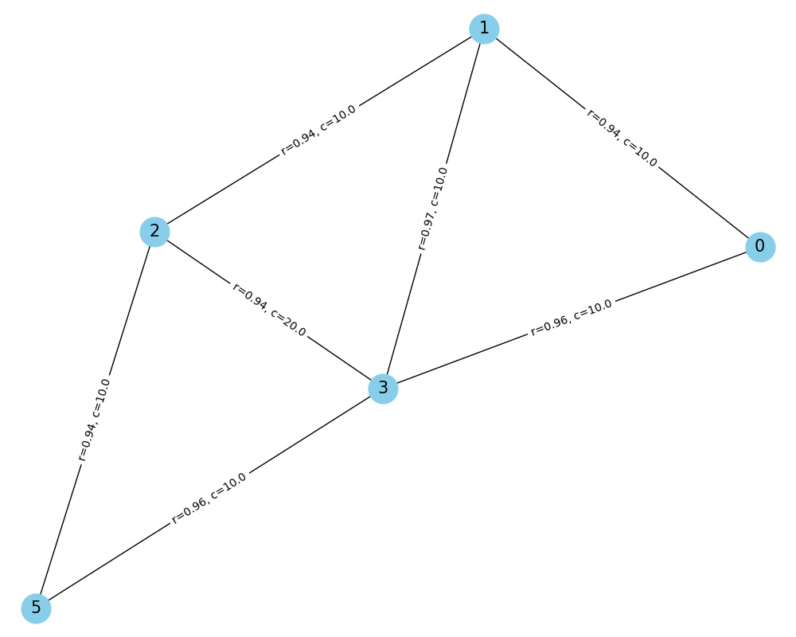

# ECSE 422 Network Design Assignment

- Hassan Gaber 260891600
- Johan Trippitelli 260917958
- Maxim Drouin 260913373

### Submission Details
- Python code is in `src/`
- Graph outputs shown for each approach inside `results/`
- An example trace of a full run is in `results/example_trace.txt`

### How to Run

- Navigate to the root of the project
- Install packages with `pip install -r requirements.txt`
- Choose which part to run by setting the appropriate booleans inside `src/main.py` or do not modify to run all three approaches.
- Run `python src/main.py`
- If a `networkx` random state error arises, run `pip install decorator==5.0.9` and retry.

### Description

The main objective of this assignment is to compare a brute-force and guided search approach to solving a network optimization problem. The problem's constraints include a maximum cost constraint, a node constraint, and the objective of maximizing network overall reliability. The two approaches should yield the same solutions with the guided search arriving at the optimal graph faster than the brute-force method.

The brute-force algorithm generates the optimal graph using the following approach: 1. Generate all the possible graphs given the number of nodes and full connectivity of the graphs 2. Filter the graphs based on the edge cost and maximum cost constraint 3. Compute all graph reliabilities and choose the highest reliability graph.

The guided search algorithm finds the optimal graph using the a greedy heuristic where the objective is minimizing the cost-to-reliability ratio of the links between the nodes.

#### Monte-Carlo Approach to Computing Reliability

Reliability is the probability that the graph works (is fully-connected; you can visit any node regardless of the node you are at). By creating simulations of removing edges and then checking for full connectivity with that modified graph, we can approximate the reliability of the graph. Eventually, if all the combination of edge disconnections is found ($2^{E}$), the exact reliability can be found. The approximation of the simulation gets better with more iterations. 

### Code Structure

1. `src/design.py` - Contains the solution class and the code for the brute-force solution, Prim's algorithm
2. `src/greedy.py` - Defines the guided search algorithm for the greedy hueristic
3. `src/read_input.py` - Function to read the `.txt` files for their cost and reliability matrices
4. `src/main.py` - Main script to run solution containing booleans to choose which approach to use to solve the constraint problem.

### Example Output

